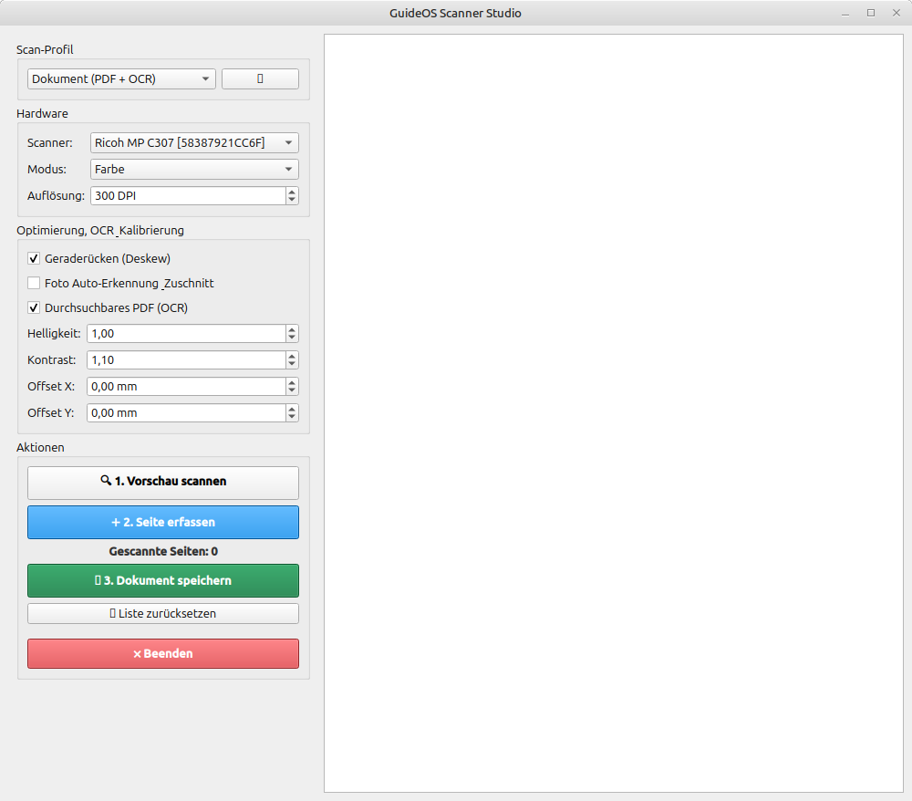
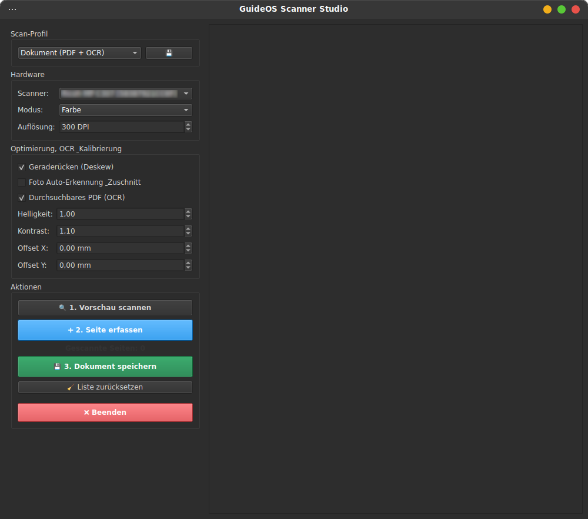

# 🖨️ GuideOS Scanner Studio
Eine moderne, leistungsfähige Open-Source Desktop-Anwendung zur Ansteuerung von Flachbett- und Dokumentenscannern unter Linux (SANE-Schnittstelle) auf Basis von **PyQt6**, **OpenCV** und **Tesseract OCR**.

<div style="display:flex; gap:10px;">
  
  
</div>
---


---

## 📄 Funktionen

- 🔍 **Live-Vorschau mit dynamischem Auswahlrechteck**: Passe den Scanbereich visuell mit Maus-Anfassern an.
- 📄 **Durchsuchbare PDFs (Native OCR)**: Automatische Texterkennung via Tesseract direkt beim Erstellen von PDF-Dateien.
- 📐 **Automatisches Geraderücken (Deskew)**: Erkennt schief aufgelegte Dokumente mittels Hough-Transformation und richtet sie automatisch aus.
- 🖼️ **Foto-Ausschneide-Automatik (Multi-Crop)**: Scanne mehrere auf dem Glas verteilte Fotos auf einmal – die Software erkennt und speichert jedes Foto einzeln.
- 🎯 **Manuelle Feinjustierung**: Offset-Korrektur (X/Y-Achse in mm) zur Kalibrierung der Hardware-Abweichungen deines Scanners.
- ⚙️ **Benutzerdefinierte Profile**: Speichere deine bevorzugten Einstellungen (DPI, Modus, OCR) dauerhaft in deinem Home-Verzeichnis (`~/.config/scanner_app/profiles.json`).
- 🎨 **Moderne Benutzeroberfläche**: Integrierter Splash-Screen und Dark-Design-Komponenten auf Basis des Qt-Fusion-Styles.

---

## 🔧 Installation für Debian / Ubuntu / Linux Mint:

**Download des `.deb` Packages, von der **[Releases](https://https://github.com/GuideOS/guideos-scanner-studio/releases)** Section in diesem Repository**   \
**Öffne ein Terminal in deinem Download-Ordner und führe folgenden Befehl aus:**
```bash
sudo apt update
sudo apt install ./guideos-scanner-studio*.deb
```
